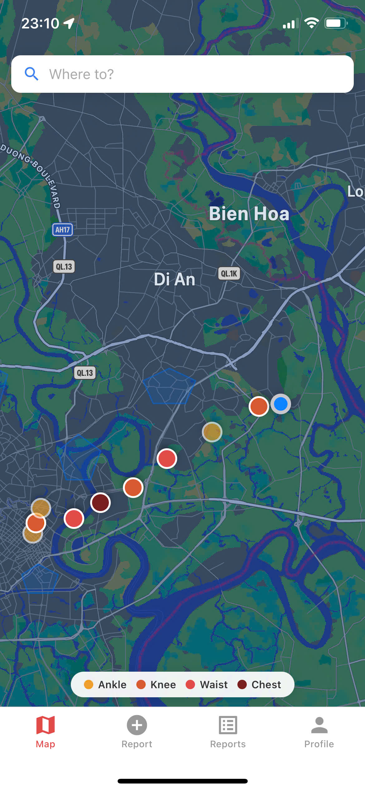
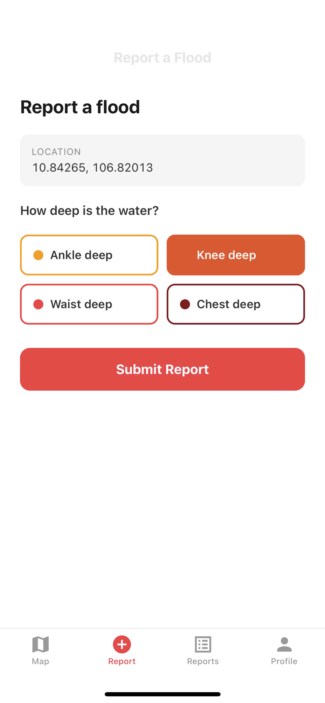
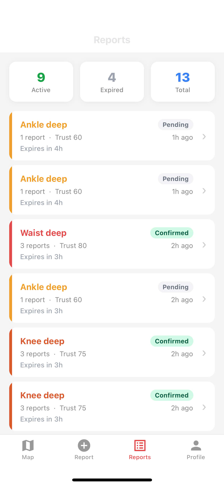
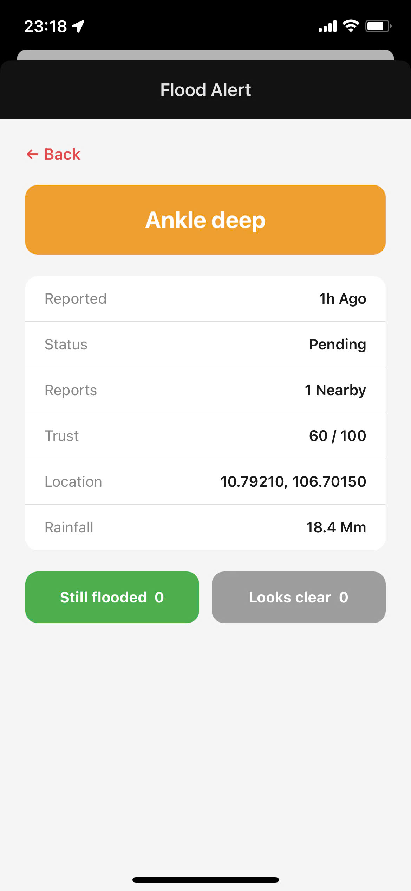
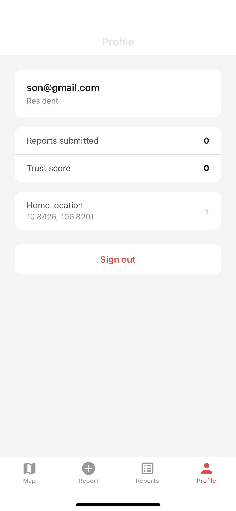

# Flood Up

**Real-time urban flood intelligence for Southeast Asian cities.**

When heavy rain hits Ho Chi Minh City, Bangkok, or Jakarta, colonial-era drainage fails in minutes. Residents leave home not knowing which streets are underwater. Drivers get dispatched into impassable routes. City crews respond only after the damage is done.

**The problem isn't the flood — it's that nobody knows where the water is.**

---

## How it works

Residents and drivers submit a one-tap flood report — location auto-filled by GPS, depth selected from four options (ankle / knee / waist / chest). The report hits a verification pipeline, appears on the live map within seconds, and pushes alerts to nearby users.

Three independent reports in the same area within 30 minutes → **confirmed**. Six hours without corroboration → **auto-expired**.

---

## Screenshots

### Live flood map



Active flood reports appear instantly on the map, color-coded by water depth — yellow for ankle, orange for knee, red for waist, dark red for chest. The depth legend sits above the tab bar so it's always visible.

---

### Submit a report



One tap to open the report form. GPS fills in your location automatically — just pick the water depth and hit Submit. The whole flow takes under 10 seconds.

---

### Reports list



The Reports tab shows all active and expired reports with their depth, status (Pending / Confirmed), trust score, corroboration count, and time remaining before auto-expiry.

---

### Flood alert detail



Tap any report to see the full detail — depth, status, number of nearby corroborating reports, trust score, coordinates, and live rainfall reading. Community members can vote "Still flooded" or "Looks clear" to keep the data fresh.

---

### Profile



Each user account tracks reports submitted and trust score. Trust score rises when your reports get corroborated by others, and is used by the pipeline to weight future reports. Home location determines which flood alerts you receive as push notifications.

---

### Route search with flood warning

<video src="pics/7911630965911.mp4" controls width="300"></video>

Search any destination and the app checks your route against active flood reports. Flooded road segments are highlighted in red, and a warning banner appears so you can reroute before you leave.

---

## Trust pipeline

Every report is scored before it can trigger alerts:

| Check | Method |
|---|---|
| Velocity check | Hard rejects physically impossible movement between reports |
| Weather correlation | Open-Meteo API — soft penalty during dry conditions |
| Corroboration | 3 independent nearby reports within 30 min → `confirmed` |

Reports start at trust score 70. Only confirmed reports (or high-severity single reports above the trust threshold) trigger push notifications.

---

## Tech stack

| Layer | Choice |
|---|---|
| Mobile | React Native (Expo) |
| Backend | Firebase — Firestore, Auth, Cloud Functions, Storage |
| Push notifications | Expo Notifications + FCM |
| Weather | Open-Meteo (free, no key required) |
| Geo queries | geofire-common (geohash radius) |

---

## Getting started

**Prerequisites:** Node.js 18+, Firebase CLI, a Firebase project with Firestore / Auth / Storage / Functions enabled.

```bash
git clone <repo-url> flood-up
cd flood-up
cp mobile/.env.example mobile/.env   # fill in Firebase + Maps API keys
./init.sh                            # installs deps, type-checks, deploys Firebase, starts Expo
```

Scan the QR code in Expo Go to open the app on your phone.

**`mobile/.env`**
```
EXPO_PUBLIC_FIREBASE_API_KEY=
EXPO_PUBLIC_FIREBASE_AUTH_DOMAIN=
EXPO_PUBLIC_FIREBASE_PROJECT_ID=
EXPO_PUBLIC_FIREBASE_STORAGE_BUCKET=
EXPO_PUBLIC_FIREBASE_MESSAGING_SENDER_ID=
EXPO_PUBLIC_FIREBASE_APP_ID=
EXPO_PUBLIC_GOOGLE_MAPS_API_KEY=
```

**`init.sh` flags**
```
./init.sh --verify     # type-check only, no deploy, no start
./init.sh --no-deploy  # skip Firebase deploy, just start Expo
./init.sh --no-start   # deploy only, do not launch Expo
```

---

## Repository structure

```
flood-up/
├── mobile/       # Expo React Native app (residents + drivers)
├── functions/    # Firebase Cloud Functions (trust pipeline, alerts, expiry)
└── docs/         # Architecture, data model, core flows
```

---

## License

MIT
